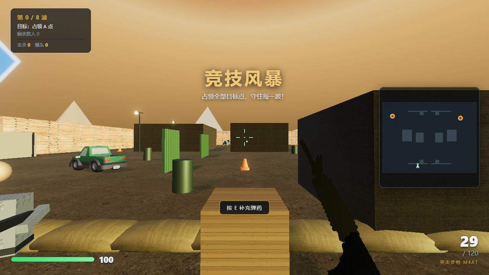
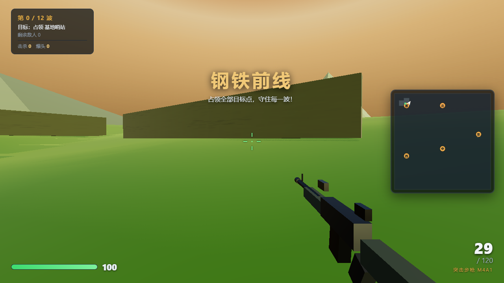
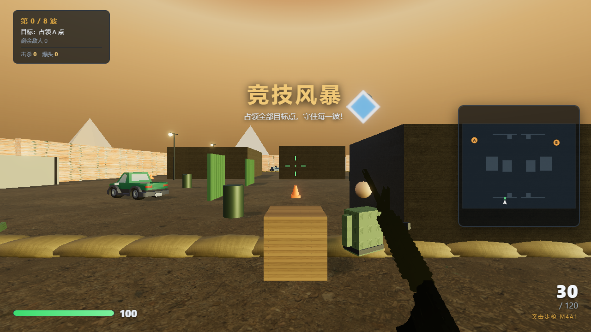
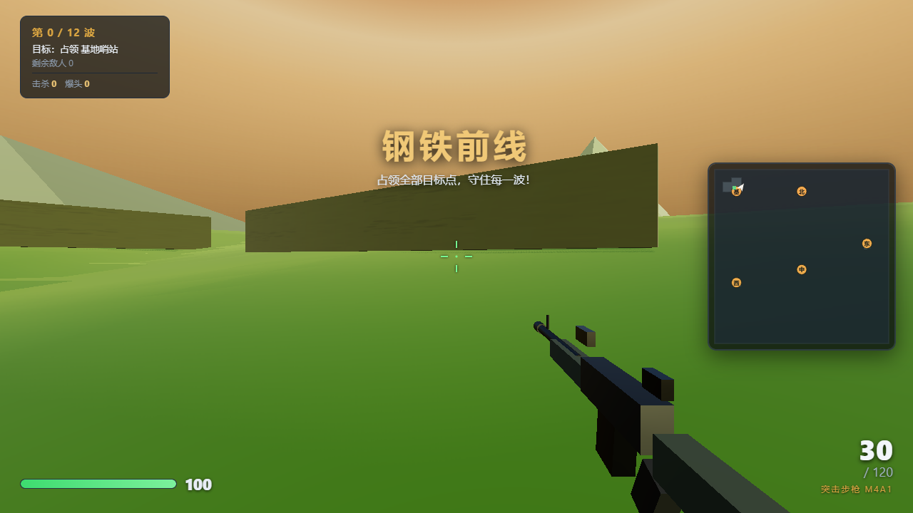
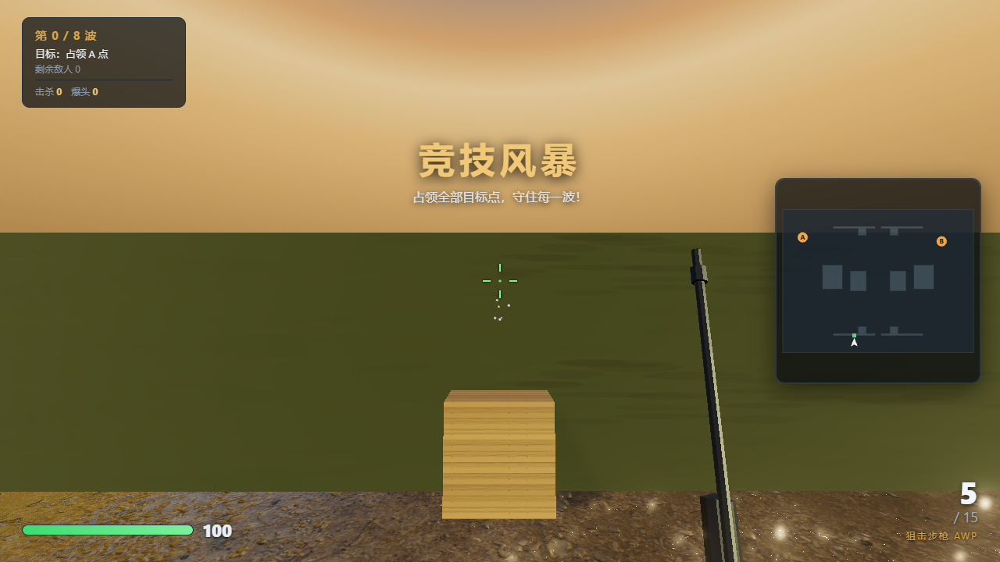

# 钢铁子午线 · Steel Meridian

> **A browser-native tactical FPS built with Three.js.**
>
> 两种尺度的战斗、爆破目标、AI 小队、陆空载具与本地化视听资源，全部运行在浏览器中。

<p align="center">
  
  
</p>

## 项目亮点

- **两种战斗尺度**：96×72m 爆破竞技场 + 400×400m 20V20 大战场。
- **完整武器循环**：M4A1、USP、AWP、手雷，包含后坐力、散布、换弹、检视、曳光弹、弹壳与弹着反馈。
- **爆破模式**：A/B 双目标点、C4 下包/倒计时/引爆、敌军拆包 AI，不使用波次刷怪替代爆破规则。
- **AI 小队**：突击、重甲、狙击、自爆、火箭等兵种；包含追击、调查、绕障、侧移、撤退与协同交火。
- **20V20 大战场**：双方持续增援并争夺 5 个据点，AI 与玩家均可使用地面及空中载具。
- **载具系统**：吉普、坦克与武装直升机，包含驾驶、耐久、撞击、武器与爆炸伤害。
- **本地视听资源**：Three.js、模型、PBR 纹理、音效与音乐均随项目提供，游戏运行时无需外部 CDN。

## 画面预览

<p align="center">
  
  
  
</p>

## 快速开始

> 游戏使用 ES Modules，不能直接通过 `file://` 双击 `index.html` 运行。

### Windows

双击：

```text
start.bat
```

### Node.js

```bash
npm install
npm start
```

然后访问：

```text
http://localhost:8080
```

建议使用最新版 Chrome / Edge，并开启硬件加速。

## 操作

| 按键 | 功能 |
| --- | --- |
| `WASD` | 移动 |
| `Shift` | 冲刺 |
| `Space` | 跳跃 |
| `C` | 蹲下 |
| 鼠标左键 | 开火 / 载具主武器 |
| 鼠标右键 | 爆破模式狙击开镜 / 大战场机械瞄具 / 载具副武器 |
| `Q` / 滚轮 / `1-4` | 切换武器 |
| `R` | 换弹 |
| `G` | 投掷手雷 |
| `E` | 交互 / 上下载具 / 下包 |
| `V` | 检视武器 |
| `M` | 小地图 |
| `Esc` | 暂停 |

## 游戏结构

```text
fps-battle/
├── index.html
├── css/
│   └── style.css
├── js/
│   ├── main.js               # 主循环、模式与全局状态
│   ├── player.js             # 玩家控制
│   ├── weapons.js            # 武器 / 弹道 / 第一人称枪模
│   ├── enemy.js              # 敌方 AI
│   ├── allies.js             # 友军 AI
│   ├── navigation.js         # 导航与绕障
│   ├── vehicles.js           # 陆空载具
│   ├── battlefield_mode.js   # 大战场规则
│   ├── maps/                 # 竞技场与大战场
│   ├── fx.js                 # 粒子与战斗反馈
│   ├── audio.js              # 音效 / 音乐
│   ├── hud.js                # HUD / 小地图 / 提示
│   └── tex.js                # 材质与程序纹理
├── assets/                   # 模型、纹理、音频等第三方资源
├── vendor/                   # 本地 Three.js 运行时
├── tests/                    # 自动验证与游戏截图
├── server.js
└── start.bat
```

## 自动测试

```bash
npm test
```

当前测试覆盖地图构建、碰撞、AI、控制手感、武器表现、大战场载具与战斗修复等关键路径。

GitHub Actions 会在 Pull Request 与 `main` 分支提交时自动执行测试。

## 技术栈

- JavaScript / ES Modules
- Three.js `0.185.1`
- WebGL
- Web Audio API + 本地音频素材
- HTML / CSS
- Node.js 本地静态服务器

## 第三方资源与许可

项目代码采用 **MIT License**。

仓库同时包含来自 Three.js、Kenney、OpenGameArt、Poly Haven 等来源的第三方模型、纹理、音频与音乐。它们继续受各自原始许可证约束，不因项目代码采用 MIT 而被重新授权。

详细信息见 [`THIRD_PARTY_NOTICES.md`](THIRD_PARTY_NOTICES.md)。

## Roadmap

- [ ] 将 `main.js` 继续拆分为模式、战斗与场景生命周期模块
- [ ] 继续完善载具 AI 与步兵导航
- [ ] 增加更多可破坏场景与战场反馈
- [ ] 增加性能基准与稳定的帧时间统计
- [ ] 部署浏览器在线试玩版本
- [ ] 使用 Release 管理可玩版本与更新日志

## 项目定位

Steel Meridian 是一个独立的浏览器战术射击实验项目，用于探索 Three.js 在第一人称战斗、AI、载具和大规模场景方面的实现方式。项目名称与第三方商业游戏及其发行商不存在关联。
